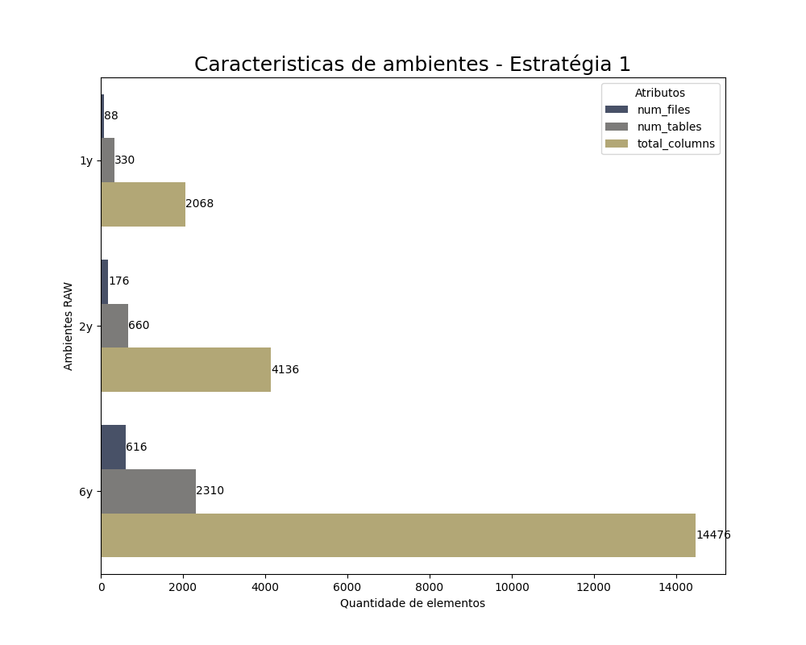
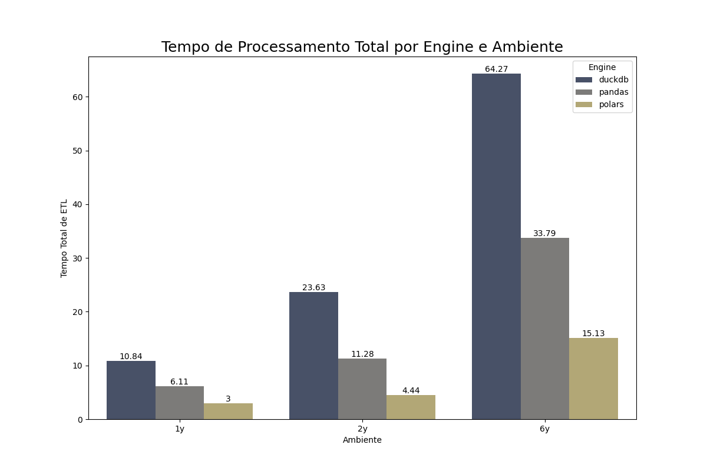
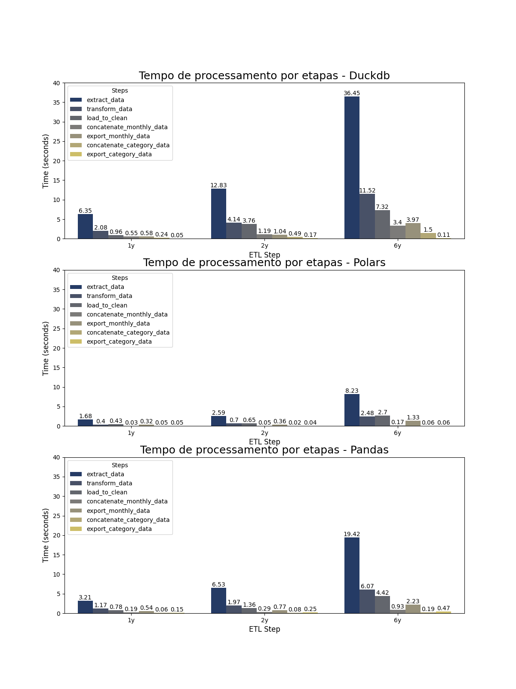
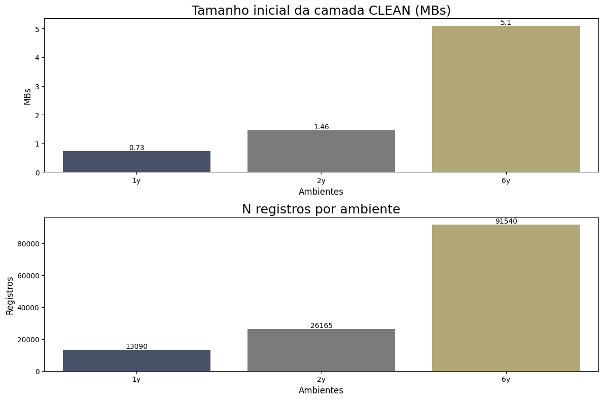
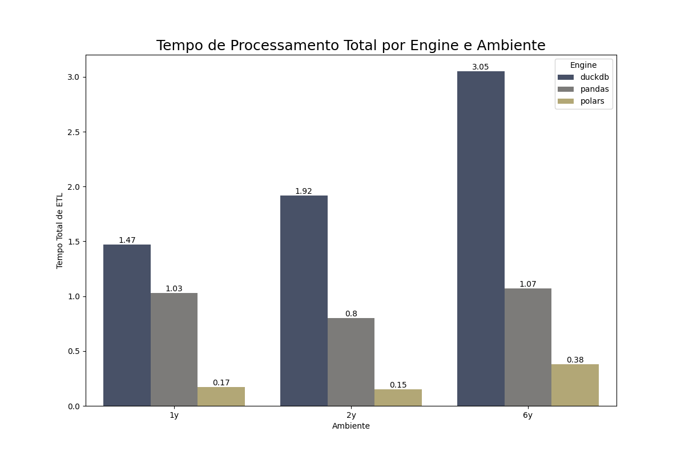
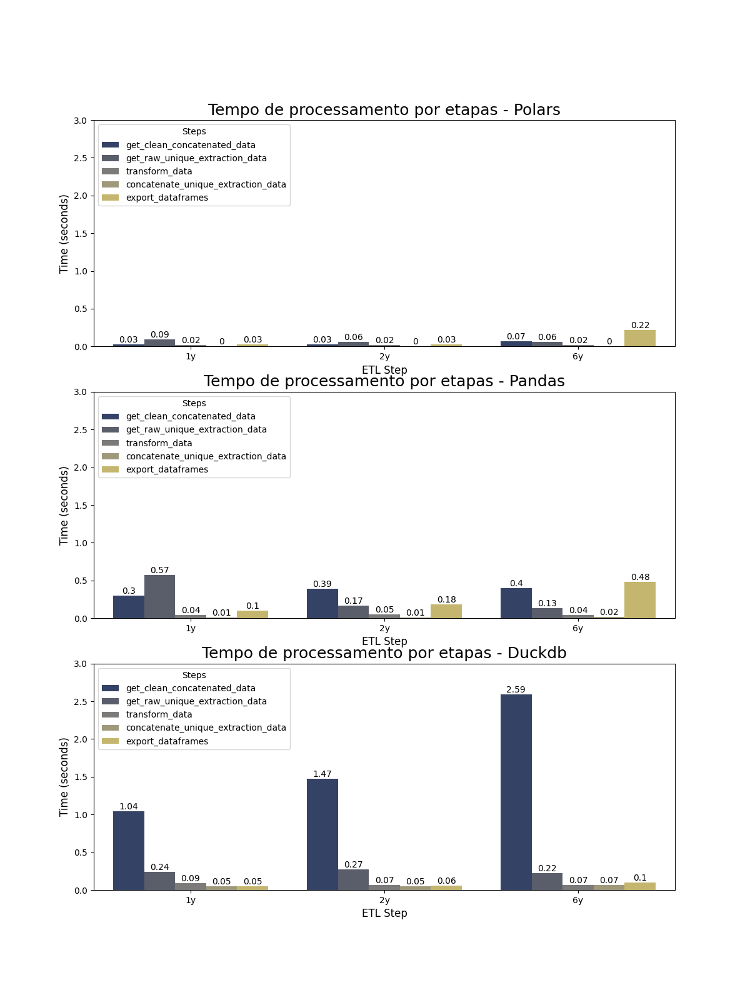

## Introdução
Como voluntário engenheiro de dados Jr na SouJunior, fui encarregado de uma tarefa crucial: comparar diferentes engines de processamento de dados para identificar a melhor opção para nossa pipeline de ETL (Extração, Transformação e Carga).

Nossa pipeline processa dados extraídos da página do LinkedIn da SouJunior, com extrações ocorrendo a cada 15 dias. Em cada rotina de extração, são gerados quatro arquivos no formato .xls, correspondentes às categorias de `Conteúdo`, `Visitantes`, `Seguidores` e `Concorrentes`.

O objetivo deste artigo é analisar a performance de três engines de processamento de dados: `Pandas`, `Polars` e `DuckDB`. A análise será utilizada para ajudar a determinar qual dessas engines se encaixa melhor como principal ferramenta na nossa pipeline de ETL.

## Sumário

- [Introdução](#introdução)
- [Sumário](#sumário)
- [Engines de processamento](#engines-de-processamento)
  - [Pandas](#pandas)
  - [Polars](#polars)
  - [DuckDB](#duckdb)
- [Abordagens](#abordagens)
  - [Estratégia de processamento 1](#estratégia-de-processamento-1)
  - [Estratégia de processamento 2](#estratégia-de-processamento-2)
- [Resultados](#resultados)
  - [Estratégia de processamento 1](#estratégia-de-processamento-1-1)
    - [Resultados para a Estratégia 1](#resultados-para-a-estratégia-1)
  - [Estratégia de processamento 2](#estratégia-de-processamento-2-1)
    - [Resultados para a Estratégia 2](#resultados-para-a-estratégia-2)
- [Resultado geral](#resultado-geral)
- [Análise pessoal sobre as engines](#análise-pessoal-sobre-as-engines)
  - [Pandas](#pandas-1)
  - [Polars](#polars-1)
  - [DuckDB](#duckdb-1)
- [Escolha da engine principal](#escolha-da-engine-principal)

## Engines de processamento

### Pandas

Pandas é a principal biblioteca do Python para análises de dados. Conhecida por sua facilidade de uso e integração com outras bibliotecas do ecossistema Python, como NumPy, Matplotlib e SciPy. O Pandas é amplamente utilizado para manipulação e análise de dados em pequenos e médios volumes.

### Polars

Polars é uma biblioteca emergente escrita em Rust, conhecida por sua alta performance. Ela oferece uma API similar à do Pandas, mas é otimizada para lidar com grandes volumes de dados de forma eficiente e rápida.

### DuckDB

DuckDB é um banco de dados SQL embutido, projetado para análises de dados. Ele se destaca pela simplicidade de uso, com suporte a consultas complexas e integração com formatos comuns de dados como CSV e Parquet.

## Abordagens

Para determinar a melhor engine de processamento de dados para nossa pipeline de ETL, utilizamos duas estratégias distintas de processamento. Cada abordagem foi projetada para testar diferentes capacidades das engines, fornecendo uma visão abrangente de sua performance em cenários variados.

### Estratégia de processamento 1
A primeira estratégia de processamento envolve trabalhar com toda a base de dados bruta. Esse processo consiste em ler, tratar e unir os dados de todas as extrações, para então exportá-los para uma camada "CLEAN".

Durante a execução dessa estratégia, foi analisado 3 senários. Com dados de 1, 2 e 6 anos de extrações.

**Objetivo:** Analisar a capacidade de cada engine de ler e processar uma grande quantidade de arquivos simultaneamente, avaliando sua eficiência e desempenho em um cenário de carga de dados volumosa.

### Estratégia de processamento 2
A segunda estratégia adotada durante os testes é trabalhar com uma camada de dados já limpos e tratados. Nesta abordagem, as engines são utilizadas para ler os dados de apenas um mês, realizar o tratamento necessário e, em seguida, adicionar esses dados à camada "clean" pré-existente.

**Objetivo:** Analisar a capacidade de cada engine de trabalhar com uma camada "clean" já existente que contém uma grande quantidade de dados, e realizar o append de novos dados de maneira eficiente.

## Resultados

**Disclaimer:** Os resultados apresentados a seguir foram gerados com códigos desenvolvidos por um engenheiro Jr, utilizando técnicas simples para cada engine. É importante destacar que o uso de códigos mais avançados, combinando técnicas variadas e integrando outras bibliotecas, poderia influenciar significativamente os resultados dos testes. Portanto, especialistas em cada engine podem obter diferentes resultados ao otimizar e ajustar o processamento de dados.

_Neste artigo não irei detalhar cada etapa de processamento, mas disponibilizei neste repositório (link para rep)_

### Estratégia de processamento 1

A primeira estratégia de processamento avalia a capacidade de cada engine de lidar com múltiplos arquivos nos formatos .xls e .xlsx. Este teste é fundamental para entender a escalabilidade e a eficiência de processamento em cenários com grandes volumes de dados.

Para os testes, foram definidos três ambientes fictícios, cada um com diferentes volumes de dados:

- **Ambiente 1:** Contém os dados atuais extraídos até o momento (correspondente a 1 ano de extrações).
- **Ambiente 2:** Contém o dobro da quantidade de dados do Ambiente 1.
- **Ambiente 3:** Contém o triplo da quantidade de dados do Ambiente 1.

A finalidade desses ambientes é colocar à prova a escalabilidade de cada engine de processamento, permitindo uma análise comparativa de desempenho à medida que o volume de dados aumenta. No gráfico abaixo, é possível visualizar as características de cada ambiente.

Abaixo podemos observar o tempo total que cada engine gastou em cada ambiente

É notável a vantagem que o Polars leva sobre os concorrentes.

Neste outro gráfico podemos ver com mais detalhes como cada engine desempenha em cada etapa do ETL:

#### Resultados para a Estratégia 1

1. **Leitura dos Dados:**
    
    - **DuckDB:** Teve o pior desempenho nesta etapa. Se tratando de arquivos .xls, o DuckDB não tem funções nativas para leitura, é preciso ler os dados com o Pandas e em seguida fazer uma conversão para tabelas duckDB.
    - **Polars:** Executou a leitura de forma extremamente rápida, sua performance advém em parte da sua escrita em Rust (baixo nível).
    - **Pandas:** A leitura dos arquivos foi a etapa mais demorada, especialmente em ambientes com maior volume de dados.
2. **Transformação dos Dados:**
    
    - **DuckDB:** Boa performance, embora com um tempo maior comparado a Polars.
    - **Polars:** Concluiu as transformações rapidamente, mantendo sua liderança.
    - **Pandas:** Razoavelmente eficiente, mas o tempo total ainda foi maior devido à leitura inicial lenta.
3. **Exportação para Camada Clean:**
    
    - **DuckDB:** Eficiente, mas com um tempo de processamento total maior.
    - **Polars:** Realizou a exportação de forma rápida e eficiente.
    - **Pandas:** Levou um tempo considerável, desempenhando o pior papel entre as engines.

### Estratégia de processamento 2

A segunda estratégia de processamento avalia a capacidade de cada engine de lidar com uma camada CLEAN já criada e salva como arquivos .csv e realizar a leitura e o append de novos dados, referentes a extrações de 1 mês (8 arquivos .xls / .xlsx). Este teste visa entender como as engines performam com a leitura de dados em uma camada já processada e realizar o append de novos dados.

Para os testes, foram definidos três ambientes fictícios, cada um com diferentes volumes de dados:

- **Ambiente 1:** Contém uma camada CLEAN com dados atuais extraídos até o momento (correspondente a 1 ano de extrações) já processados.
- **Ambiente 2:** Contém o dobro da quantidade de dados do Ambiente 1.
- **Ambiente 3:** Contém o triplo da quantidade de dados do Ambiente 1.

A finalidade desses ambientes é colocar à prova a escalabilidade de cada engine de processamento, permitindo uma análise comparativa de desempenho à medida que o volume de dados aumenta. No gráfico abaixo, é possível visualizar as características de cada ambiente.

O gráfico abaixo mostra o desempenho geral de cada engine nos determinados ambientes:

Embora o polars continue mantendo a liderança, o DuckDB mostrou um desempenho mais parelho com o pandas. Abaixo é detalhado o desempenho em cada etapa do processo:

#### Resultados para a Estratégia 2

1. **Leitura dos Dados:**
    
    - **DuckDB:** Embora na leitura da camada clean, com arquivos .csv seja realizada com funções nativas do DuckDB, isso não correspondeu em uma vantagem sobre as demais engines
    - **Polars:** Executou a leitura de forma extremamente rápida, podemos notar também um resultado ainda melhor quando a engine realiza a leitura de arquivos .csv.
    - **Pandas:** A leitura dos arquivos teve uma performance rápida e mostrou uma boa escalabilidade.
2. **Transformação dos Dados:**
    
    - **DuckDB:** Boa performance, embora com um tempo maior comparado a Polars.
    - **Polars:** Concluiu as transformações rapidamente, mantendo sua liderança.
    - **Pandas:** Razoavelmente eficiente, mas o tempo total ainda foi maior devido à leitura inicial lenta.
3. **Exportação para Camada Clean:**
    
    - **DuckDB:** Eficiente, chegando até a desempenhar o melhor resultado em alguns testes.
    - **Polars:** Realizou a exportação de forma rápida e eficiente.
    - **Pandas:** Levou um tempo considerável, desempenhando o pior papel entre as engines.

## Resultado geral
Os resultados demonstram que Polars é a engine mais eficiente em termos de tempo de processamento, se destacando em todas as etapas de processamento. Em segundo lugar, aparece Pandas, que, apesar de ser mais lento que Polars, ainda apresenta um desempenho razoável. DuckDB, embora tenha uma curva de aprendizado rápida devido ao uso de queries SQL, ficou em terceiro lugar devido a sua menor eficiência na leitura de arquivos .xls.

## Análise pessoal sobre as engines

### Pandas

Eu já tinha uma base de conhecimento com Pandas, e este estudo aprofundou meu entendimento sobre a engine. A familiaridade com suas funções facilitou a criação do fluxo de processamento, que seguiu a mesma logica para outras engines. (O que pode ter influenciado nos resultados)

### Polars

Explorar a biblioteca Polars foi um desafio inicial. Acostumado com Pandas, algumas funções semelhantes me confundiram e geraram retrabalho. No entanto, Polars me surpreendeu pelo seu desempenho, mantendo a eficiência mesmo ao trabalhar com arquivos .xls.

### DuckDB

Minha experiência com DuckDB foi mista. Inicialmente, estava empolgado com suas premissas e a possibilidade de utilizar SQL dentro do Python. Porém, o desempenho na leitura dos arquivos .xls foi decepcionante, apesar de ter mostrado um desempenho aceitável nas demais etapas. A curva de aprendizado foi rápida devido à familiaridade com SQL, mas sua eficiência não foi suficiente para competir com Polars e Pandas.

## Escolha da engine principal

Com base nos resultados dos testes e considerando a quantidade de dados que temos para processar, assim como a rotatividade de membros nos projetos, decidimos adotar Pandas como a engine principal. 

Embora o Polars tenha demonstrado superioridade em termos de desempenho, optamos pelo Pandas devido à sua vasta documentação disponível em diversos formatos, ampla comunidade de suporte, e facilidade de integração com outras bibliotecas do ecossistema Python. Esses fatores são cruciais para garantir a continuidade e eficiência dos projetos, especialmente em um ambiente com alta rotatividade de membros.